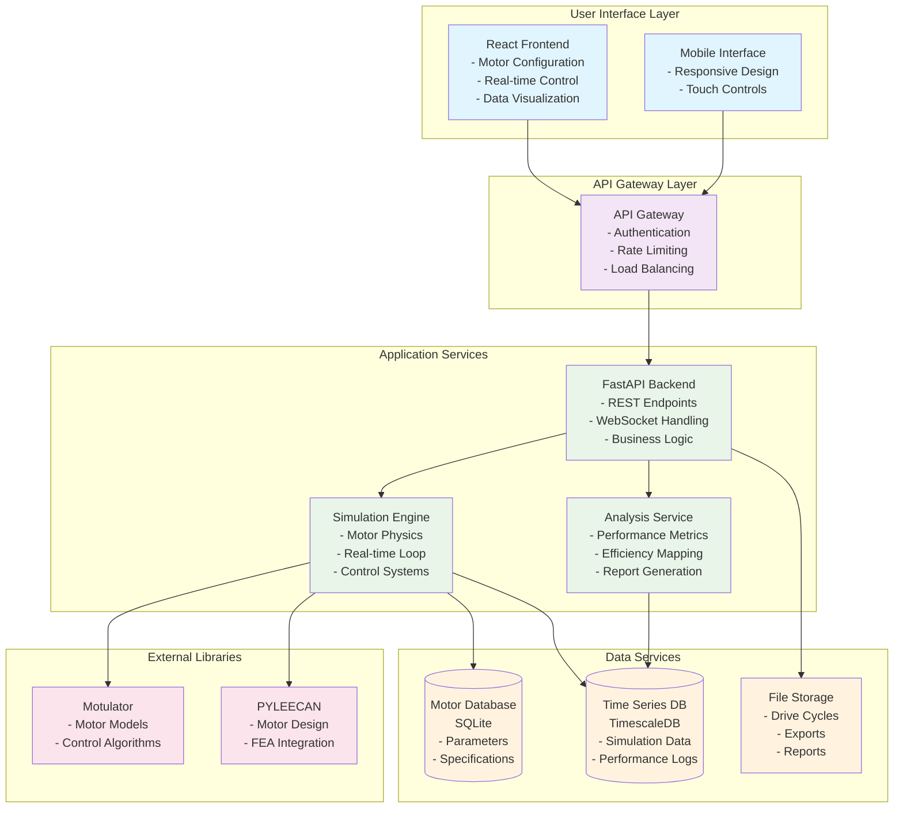
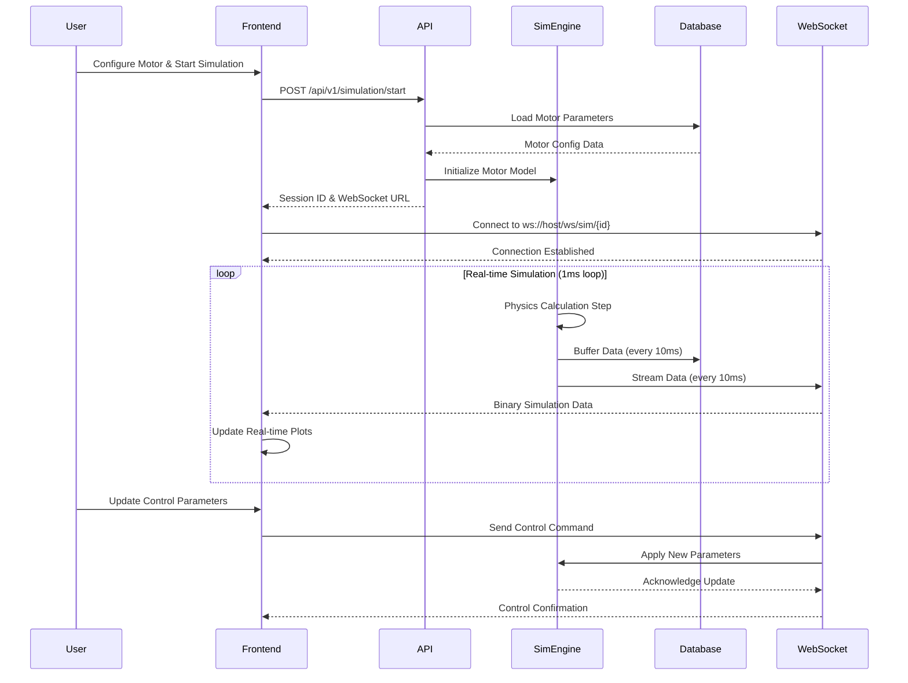
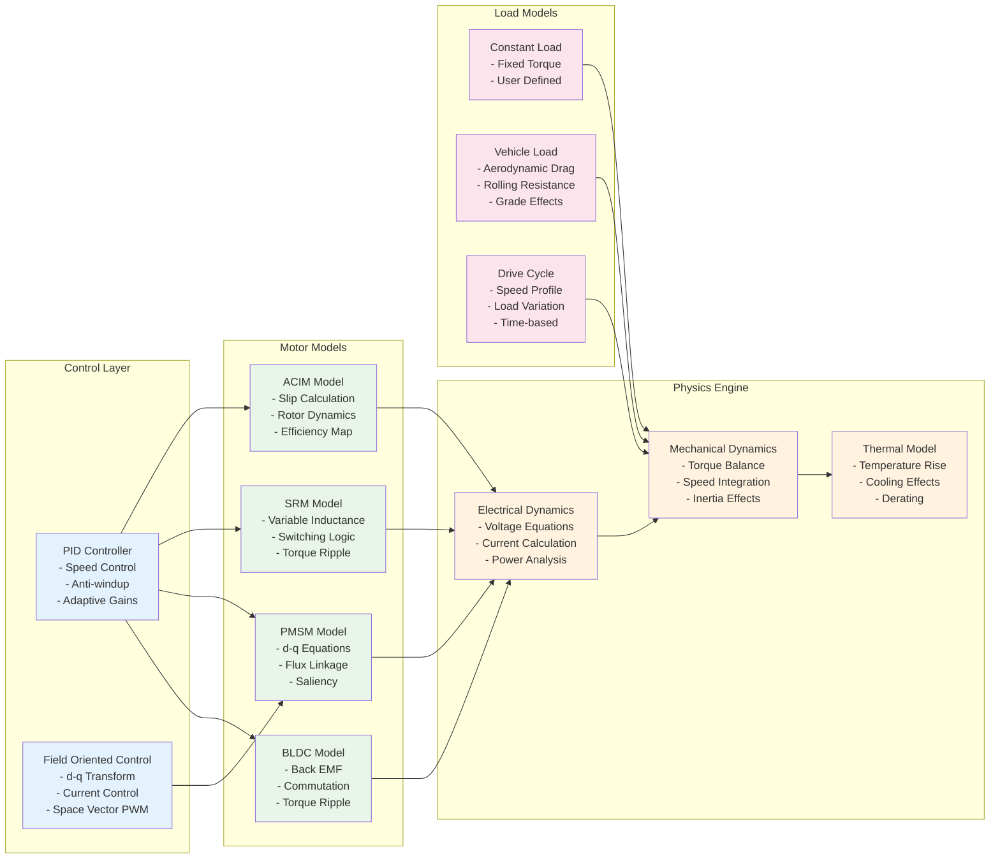
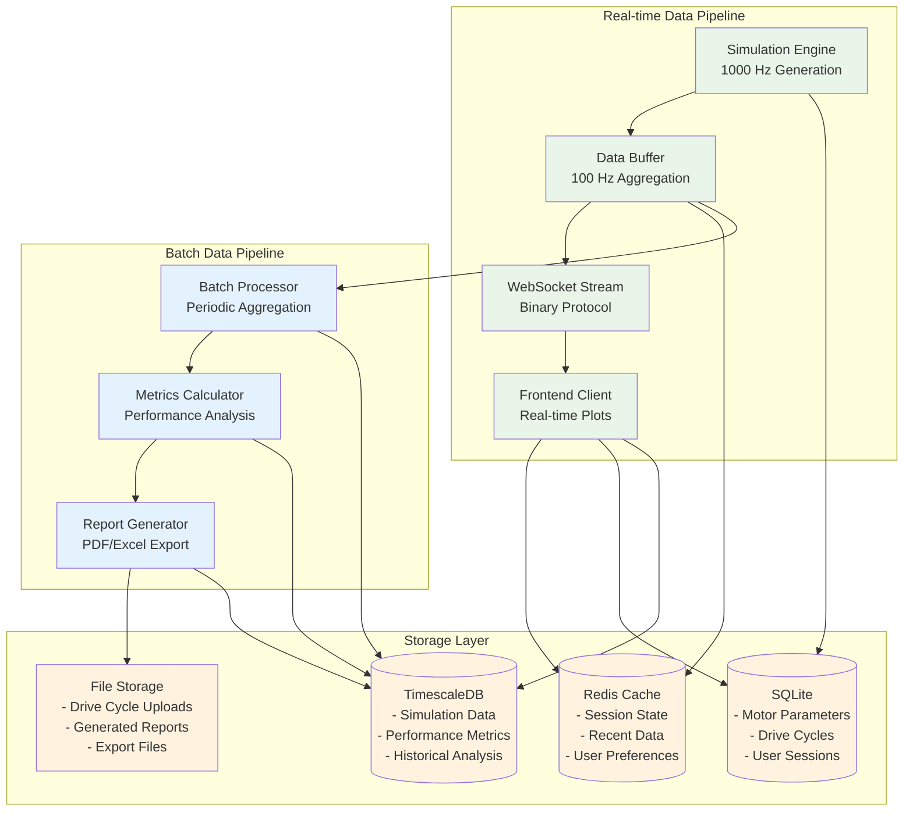
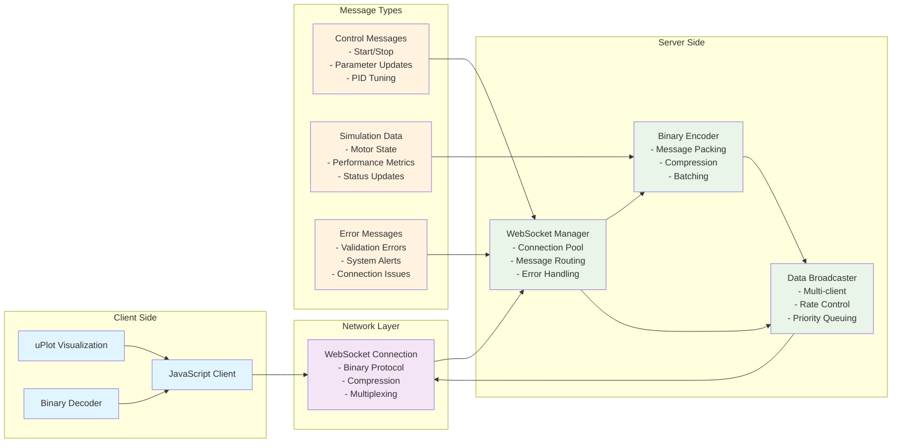
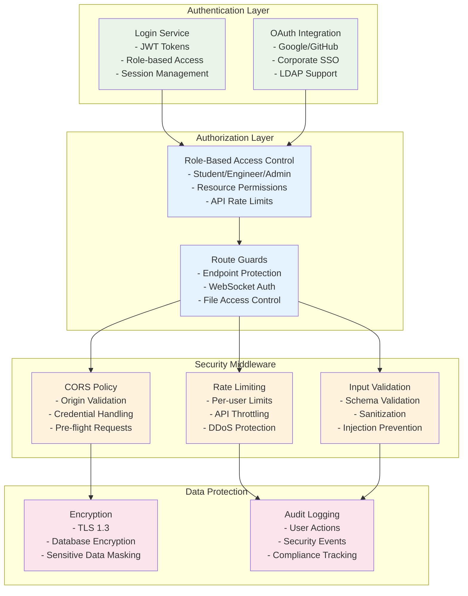
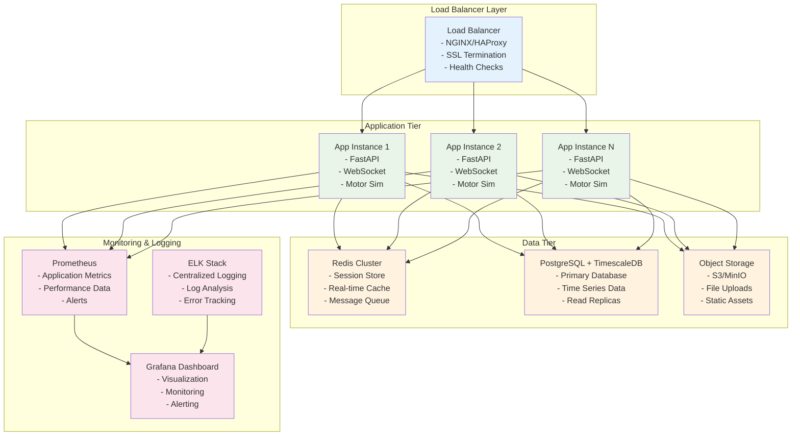

# System Architecture Diagrams

## High-Level System Architecture

## Real-Time Data Flow Architecture

## Motor Simulation Engine Architecture

## Data Architecture and Storage

## WebSocket Communication Protocol

## Security Architecture

## Deployment Architecture

These architecture diagrams provide a comprehensive view of the Motor Simulation System, from high-level system structure to detailed component interactions and deployment considerations.
